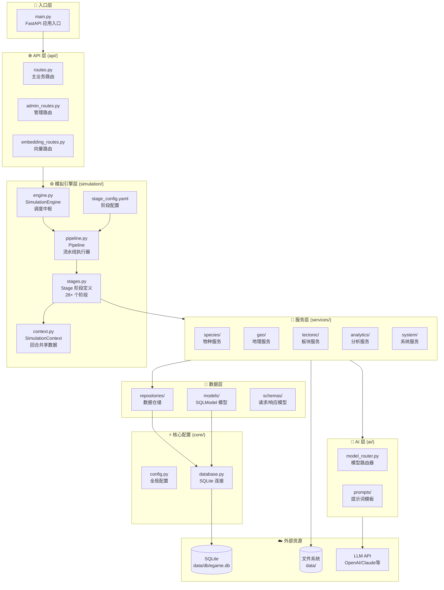
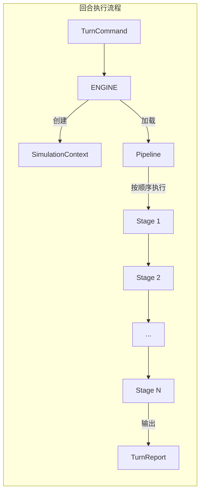
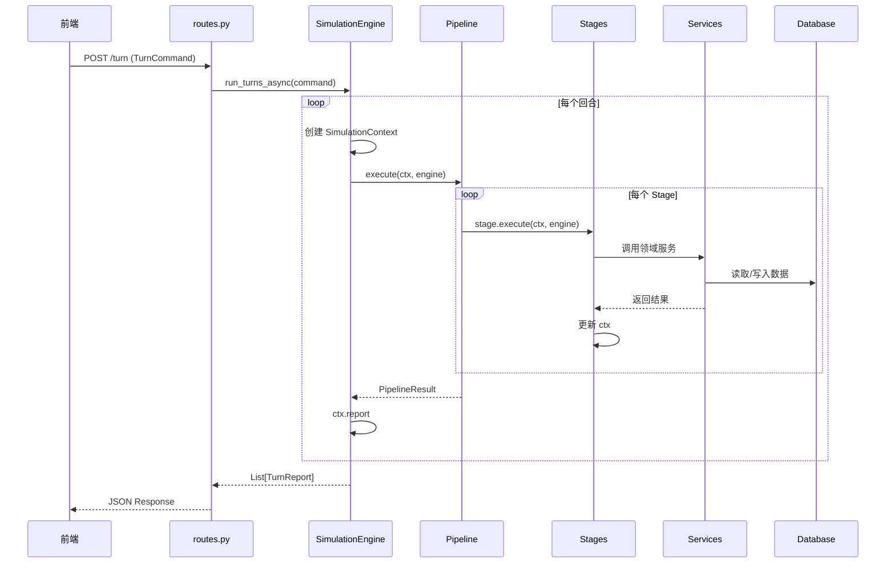
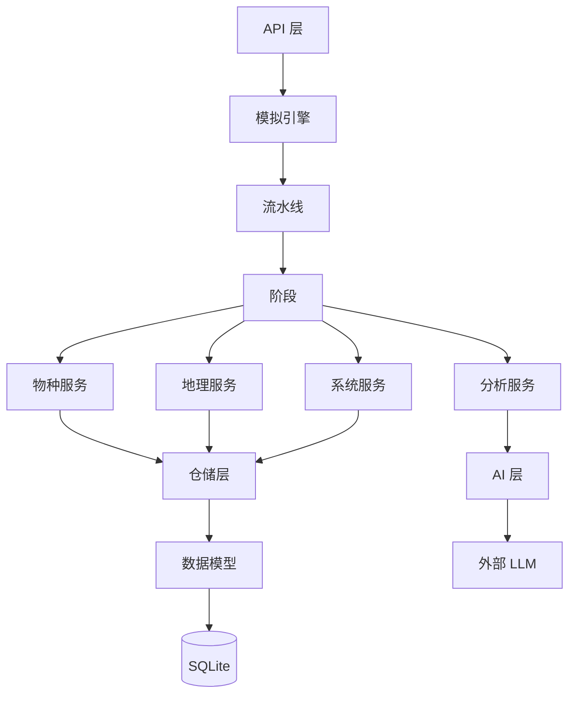

# Clade 后端详细架构文档

这是一个进化模拟游戏的后端系统，基于 FastAPI 构建。本文档将帮助你理解整个系统的架构和各模块的职责。

---

## 📊 总体架构图



---

## 🏛️ 分层架构详解

### 1. 入口层 (`main.py`)

```
📁 backend/app/main.py
```

**职责**：
- FastAPI 应用初始化
- 请求日志中间件（记录所有请求状态）
- 数据库初始化
- 路由注册

**关键代码**：
```python
app = FastAPI(title="Clade")
app.include_router(api_router, prefix="/api")     # 主业务
app.include_router(admin_router, prefix="/api")   # 管理功能
app.include_router(embedding_router)              # 向量嵌入
```

---

### 2. API 层 (`api/`)

| 文件 | 职责 | 关键端点 |
|------|------|----------|
| `routes.py` | 主业务逻辑 | `/turn`, `/species/*`, `/saves/*`, `/map/*` |
| `admin_routes.py` | 管理功能 | `/admin/reset`, `/health`, `/system/logs` |
| `embedding_routes.py` | 向量操作 | `/api/embedding/*` |

**routes.py 核心功能**：
- 回合执行 (`POST /turn`)
- 物种管理 (生成、编辑、关注列表)
- 存档系统 (保存、加载、导出)
- 地图查询 (栖息地、分布)
- 能量与神迹系统

---

### 3. 模拟引擎层 (`simulation/`)

这是系统的核心，负责回合模拟的调度和执行。



#### 3.1 engine.py - SimulationEngine

**角色**：瘦调度器（不承载业务逻辑）

**主要职责**：
1. 依赖注入：持有所有服务的引用
2. 模式管理：`minimal`/`standard`/`full`/`debug`
3. Pipeline 调度：驱动回合执行

**关键方法**：
```python
set_mode(mode)                    # 切换运行模式
run_turns_async(command)          # 执行多回合
run_turn_with_pipeline(command)   # 执行单回合
```

#### 3.2 pipeline.py - Pipeline

**角色**：流水线执行器

**职责**：
- 按顺序执行 Stage 列表
- 统一错误处理
- 性能监控与时间统计
- 依赖验证

#### 3.3 stages.py - Stage 阶段定义

**28+ 个阶段**，按 `order` 顺序执行：

| Order | 阶段名 | 职责 |
|-------|--------|------|
| 0 | `init` | 清理缓存，初始化上下文 |
| 10 | `parse_pressures` | 解析玩家施加的压力 |
| 20 | `map_evolution` | 地图演化（气候、海平面） |
| 25 | `tectonic_movement` | 板块构造运动 |
| 30 | `fetch_species` | 从数据库读取物种 |
| 35 | `food_web` | 构建食物网 |
| 40 | `tiering_and_niche` | 物种分级 + 生态位分析 |
| 50 | `preliminary_mortality` | 初步死亡率计算 |
| 55 | `prey_distribution` | 猎物分布计算 |
| 60 | `migration` | 迁徙处理 |
| 65 | `dispersal` | 扩散处理 |
| 66 | `hunger_migration` | 饥饿驱动的迁徙 |
| 70 | `post_migration_niche` | 迁徙后生态位更新 |
| 80 | `final_mortality` | 最终死亡率 + 灭绝判定 |
| 85 | `ai_status_eval` | AI 状态评估 |
| 90 | `population_update` | 种群数量更新 |
| 95 | `gene_activation` | 隐藏基因激活 |
| 100 | `gene_flow` | 基因流 |
| 105 | `genetic_drift` | 遗传漂变 |
| 110 | `auto_hybridization` | 自动杂交 |
| 115 | `subspecies_promotion` | 亚种晋升为新种 |
| 120 | `ai_parallel_tasks` | AI 适应/分化/叙事 |
| 130 | `background_management` | 背景物种管理 |
| 140 | `build_report` | 构建回合报告 |
| 150-175 | `save_*` / `export_*` | 持久化阶段 |
| 180 | `finalize` | 清理与收尾 |

#### 3.4 context.py - SimulationContext

**角色**：回合上下文，跨阶段共享数据

**关键字段**：
```python
# 输入
turn_index: int          # 当前回合
command: TurnCommand     # 玩家指令
pressures: list          # 解析后的压力

# 中间结果
species_batch: list      # 当前物种列表
tiered: dict             # 分级结果 {critical, focus, normal, background}
food_web_analysis: dict  # 食物网分析
preliminary_mortality: dict  # 初步死亡率
migration_events: list   # 迁徙事件

# 输出
combined_results: list   # 合并的物种结果
report: TurnReport       # 最终报告
```

#### 3.5 stage_config.yaml

**作用**：定义不同模式下启用哪些阶段

**四种模式**：
- `minimal`: 极简模式（仅核心功能）
- `standard`: 标准模式（推荐，禁用重型 AI）
- `full`: 全功能模式
- `debug`: 调试模式（含性能分析）

---

### 4. 服务层 (`services/`)

服务层包含所有业务逻辑，分为 5 个子目录：

```
services/
├── species/      # 物种相关 (30+ 文件)
├── geo/          # 地理环境 (6 文件)
├── tectonic/     # 板块构造 (12 文件)
├── analytics/    # 分析报告 (12 文件)
└── system/       # 系统服务 (8 文件)
```

#### 4.1 物种服务 (`species/`)

| 文件 | 职责 |
|------|------|
| `adaptation.py` | 适应性演化：根据压力调整特征 |
| `migration.py` | 迁徙建议：计算最佳迁徙目的地 |
| `reproduction.py` | 繁殖系统：出生率、种群增长 |
| `speciation.py` | 物种分化：新种产生 |
| `tiering.py` | 物种分级：Critical/Focus/Normal/Background |
| `gene_flow.py` | 基因流：地理隔离下的基因交流 |
| `gene_activation.py` | 基因激活：压力触发隐藏基因 |
| `hybridization.py` | 杂交：跨物种杂交 |
| `predation.py` | 捕食关系：猎物-捕食者动态 |
| `niche.py` | 生态位分析：生态位相似度计算 |
| `food_web_manager.py` | 食物网：营养级网络维护 |
| `trophic_interaction.py` | 营养级互动：能量流动 |
| `extinction_checker.py` | 灭绝检测：判断物种是否灭绝 |
| `reemergence.py` | 物种复现：灭绝物种的后代复现 |
| `intervention.py` | 玩家干预：保护、抑制、引入 |
| `species_generator.py` | 物种生成：AI 生成新物种 |
| `habitat_manager.py` | 栖息地管理：分布区域管理 |
| `dispersal_engine.py` | 扩散引擎：矩阵化扩散计算 |
| `territory_system.py` | 领地系统：领地竞争 |
| `plant_evolution.py` | 植物进化：植物特有逻辑 |
| `genetic_evolution.py` | 遗传进化：特征遗传 |
| `trait_config.py` | 特征配置：特征定义 |

#### 4.2 地理服务 (`geo/`)

| 文件 | 职责 |
|------|------|
| `map_evolution.py` | 地图演化：气候变化、海平面变化 |
| `map_manager.py` | 地图管理：地图状态查询与更新 |
| `map_coloring.py` | 地图着色：可视化颜色计算 |
| `hydrology.py` | 水文系统：河流、降水 |
| `suitability.py` | 适宜度：栖息地适宜度计算 |
| `vegetation_cover.py` | 植被覆盖：植被分布 |

#### 4.3 板块构造服务 (`tectonic/`)

| 文件 | 职责 |
|------|------|
| `tectonic_system.py` | 板块系统核心 |
| `integration.py` | 与模拟引擎的集成 |
| `motion_engine.py` | 板块运动计算 |
| `plate_generator.py` | 初始板块生成 |
| `geological_features.py` | 地质特征（山脉、裂谷） |
| `mantle_dynamics.py` | 地幔热对流 |
| `species_tracker.py` | 物种随板块移动 |
| `matrix_engine.py` | 矩阵化计算 |

#### 4.4 分析服务 (`analytics/`)

| 文件 | 职责 |
|------|------|
| `report_builder.py` | 回合报告构建 |
| `report_builder_v2.py` | 报告构建器 v2 |
| `ecosystem_health.py` | 生态系统健康评估 |
| `ecosystem_metrics.py` | 生态系统指标 |
| `critical_analyzer.py` | 高风险物种分析 |
| `focus_processor.py` | 焦点物种处理 |
| `narrative_engine.py` | 叙事生成引擎 |
| `exporter.py` | 数据导出 (Markdown/JSON) |
| `encyclopedia.py` | 物种百科全书 |
| `taxonomy.py` | 分类学服务 |
| `turn_report.py` | 回合报告数据结构 |
| `embedding_integration.py` | 向量嵌入集成 |
| `game_hints.py` | 游戏提示生成 |
| `evolution_predictor.py` | 进化预测 |
| `achievements.py` | 成就系统 |
| `population_snapshot.py` | 种群快照 |

#### 4.5 系统服务 (`system/`)

| 文件 | 职责 |
|------|------|
| `divine_energy.py` | 能量系统：操作消耗能量 |
| `divine_progression.py` | 神迹系统：技能、信仰、预言 |
| `embedding.py` | 向量嵌入服务 |
| `pressure.py` | 压力升级服务 |
| `save_manager.py` | 存档管理 |
| `vector_store.py` | 向量存储 |
| `species_cache.py` | 物种缓存 |

---

### 5. AI 层 (`ai/`)

```
ai/
├── model_router.py     # 模型路由器
└── prompts/
    ├── species.py      # 物种生成提示
    ├── narrative.py    # 叙事提示
    ├── embedding.py    # 嵌入提示
    ├── plant.py        # 植物提示
    └── pressure_response.py  # 压力响应提示
```

#### model_router.py

**职责**：
- 根据任务类型选择合适的 LLM 模型
- 支持多 Provider（OpenAI、Claude、本地模型）
- 管理模型配置（温度、token 限制）

---

### 6. 数据层

#### 6.1 模型 (`models/`)

| 文件 | 描述 |
|------|------|
| `species.py` | 物种模型：核心实体，包含形态、特征、基因等 |
| `environment.py` | 环境模型：地块、栖息地 |
| `genus.py` | 属模型：分类层级 |
| `history.py` | 历史模型：回合历史记录 |
| `taxonomy.py` | 分类模型 |
| `config.py` | 配置模型：UI 配置、模型配置 |

**Species 模型关键字段**：
```python
class Species(SQLModel):
    lineage_code: str      # 谱系代码 (如 "A1", "A1.1")
    latin_name: str        # 拉丁学名
    common_name: str       # 常用名
    morphology_stats: dict # 形态统计 {size, speed, ...}
    abstract_traits: dict  # 抽象特征
    hidden_traits: dict    # 隐藏特征（可激活）
    organs: dict           # 器官系统
    trophic_level: float   # 营养级
    diet_type: str         # 食性 (herbivore/carnivore/...)
    prey_species: list     # 捕食对象
    habitat_type: str      # 栖息地类型
    status: str            # 状态 (alive/extinct)
```

#### 6.2 仓储 (`repositories/`)

| 文件 | 职责 |
|------|------|
| `species_repository.py` | 物种 CRUD |
| `environment_repository.py` | 环境 CRUD |
| `genus_repository.py` | 属 CRUD |
| `history_repository.py` | 历史 CRUD |

#### 6.3 数据结构 (`schemas/`)

| 文件 | 内容 |
|------|------|
| `requests.py` | 请求模型：`TurnCommand`, `PressureConfig`, `GenerateSpeciesRequest` 等 |
| `responses.py` | 响应模型：`TurnReport`, `SpeciesDetail`, `MapOverview` 等 |
| `physics.py` | 物理模型 |

---

### 7. 核心配置 (`core/`)

| 文件 | 职责 |
|------|------|
| `config.py` | 全局设置（地图尺寸、模型配置等） |
| `database.py` | SQLite 数据库连接 |
| `seed.py` | 初始数据种子 |

---

## 🔄 回合执行流程图



---

## 📂 数据文件结构

```
data/
├── db/
│   └── egame.db          # SQLite 数据库
├── reports/              # 回合报告 (Markdown)
├── exports/              # 导出数据 (JSON)
├── saves/                # 存档文件
└── settings.json         # 用户设置
```

---

## 🎯 快速定位指南

| 我想要... | 去哪里找 |
|-----------|----------|
| 添加新 API 端点 | `api/routes.py` |
| 修改回合流程 | `simulation/stages.py` + `stage_config.yaml` |
| 添加新的阶段 | `simulation/stages.py` 添加类，`stage_config.yaml` 注册 |
| 修改物种逻辑 | `services/species/` 下的对应文件 |
| 修改地图逻辑 | `services/geo/` |
| 修改 AI 提示词 | `ai/prompts/` |
| 修改数据模型 | `models/` |
| 修改能量计费 | `services/system/divine_energy.py` |
| 添加新神迹 | `services/system/divine_progression.py` |

---

## 🧩 模块依赖关系



---

## 💡 架构设计原则

1. **瘦引擎**：SimulationEngine 只做调度，不承载业务逻辑
2. **阶段隔离**：每个 Stage 职责单一，通过 Context 交换数据
3. **服务分离**：领域服务按职能划分到不同目录
4. **依赖注入**：服务通过构造函数注入，便于测试
5. **配置驱动**：通过 `stage_config.yaml` 控制阶段启用


backend/app/
│
├── main.py                  # 🚪 程序入口，启动 FastAPI
│
├── api/                     # 🌐 API 层 - 处理 HTTP 请求
│   ├── routes.py            # 主要业务端点 (/turn, /species, /saves)
│   ├── admin_routes.py      # 管理端点 (/reset, /health)
│   └── embedding_routes.py  # 向量嵌入端点
│
├── simulation/              # ⚙️ 模拟引擎 - 核心！
│   ├── engine.py            # 调度器：协调所有服务
│   ├── pipeline.py          # 流水线：按顺序执行阶段
│   ├── stages.py            # 阶段定义：28+ 个回合步骤
│   ├── context.py           # 上下文：回合内共享数据
│   └── stage_config.yaml    # 配置：控制启用哪些阶段
│
├── services/                # 🔧 服务层 - 所有业务逻辑
│   ├── species/             # 物种服务（30+ 文件）
│   │   ├── adaptation.py    # 适应性演化
│   │   ├── migration.py     # 迁徙
│   │   ├── reproduction.py  # 繁殖
│   │   ├── speciation.py    # 物种分化
│   │   ├── predation.py     # 捕食关系
│   │   └── ...
│   ├── geo/                 # 地理服务
│   │   ├── map_evolution.py # 地图演化（气候、海平面）
│   │   └── map_manager.py   # 地图状态管理
│   ├── tectonic/            # 板块构造服务
│   ├── analytics/           # 分析报告服务
│   └── system/              # 系统服务（能量、存档）
│
├── ai/                      # 🤖 AI 层
│   ├── model_router.py      # 模型选择器
│   └── prompts/             # 提示词模板
│
├── models/                  # 💾 数据模型（SQLModel）
│   ├── species.py           # 物种表
│   ├── environment.py       # 环境表
│   └── ...
│
├── repositories/            # 📦 数据仓储（CRUD 操作）
│
├── schemas/                 # 📋 请求/响应数据结构
│
└── core/                    # ⚡ 核心配置
    ├── config.py            # 全局设置
    └── database.py          # 数据库连接


前端发送 POST /turn 请求
        ↓
    routes.py 接收
        ↓
    SimulationEngine.run_turns_async()
        ↓
    Pipeline 按顺序执行阶段：
        ↓
    ┌──────────────────────────────────────┐
    │ 0. init           → 初始化           │
    │ 10. parse_pressures → 解析玩家压力   │
    │ 20. map_evolution  → 地图演化        │
    │ 25. tectonic       → 板块移动        │
    │ 30. fetch_species  → 读取物种        │
    │ 35. food_web       → 构建食物网      │
    │ 40. tiering        → 物种分级        │
    │ 50. mortality      → 死亡率计算      │
    │ 60. migration      → 迁徙处理        │
    │ 80. final_mortality → 灭绝判定       │
    │ 90. population     → 种群更新        │
    │ 95-115. gene_*     → 基因系统        │
    │ 120. ai_tasks      → AI 生成         │
    │ 140. build_report  → 构建报告        │
    │ 150-175. save/export → 持久化        │
    └──────────────────────────────────────┘
        ↓
    返回 TurnReport 给前端


    