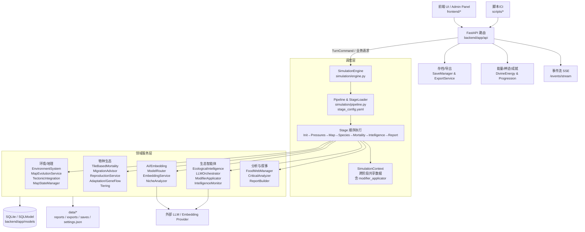

# Clade 开发文档（可视化架构与功能全解）
面向开发者的内部文档，讲清楚系统做什么、如何运转、各子系统职责及扩展入口。配合 `API_GUIDE.md` 与 `docs/api-guides/*` 使用。

## 1. 总览架构图（细粒度）


### 1.1 用更直白的话说各功能
- **回合模拟**：收到 `TurnCommand`，按 `stage_config.yaml` 的流水线依次跑环境 → 物种 → 智能体评估 → 报告/持久化。
- **地图/环境**：持续推进气候、海平面、板块位移，刷新地块/栖息地状态，供后续死亡率和迁徙使用。
- **物种生态**：基于分布与资源计算死亡率、迁徙与繁殖；分级决定哪些物种触发 AI 评估。
- **生态智能体（新）**：统一 AI 评估入口。EcologicalIntelligence 对物种打分（risk/impact/potential）并分档；LLMOrchestrator 并行调用 LLM；ModifierApplicator 提供统一修正入口，业务 Stage 不再直接读 AI 输出。
- **AI/Embedding**：ModelRouter 选择合适的 Chat/Embedding 模型；NicheAnalyzer 评估生态位；EmbeddingService 提供向量与相似度。
- **叙事与报告**：FoodWebManager 维护捕食关系；ReportBuilder 组合数值+AI 文本，写入 `data/reports` 与历史表。
- **能量/神职/神迹**：DivineEnergyService 对压力、生成、杂交、干预计费；divine_progression_service 负责神职路径、技能、神迹、信仰值、预言下注。
- **存档/导出/运维**：存档在 `data/saves/*`；导出在 `data/exports`；SSE `/events/stream` 推送队列、能量、神迹等实时事件；`admin_routes` 负责健康检查与重置。

## 2. 回合流水线（现在怎么跑）
核心组件：`SimulationEngine`（调度）+ `StageLoader/Pipeline`（装配执行）+ `SimulationContext`（共享状态）。

| 顺序 | 阶段 | 输入 | 输出/副作用 | 说明 |
| --- | --- | --- | --- | --- |
| 0-10 | init / parse_pressures | TurnCommand | ctx.pressures, ctx.modifiers | 清理缓存，解析压力模板与强度 |
| 20-30 | map_evolution / tectonic_movement | ctx.modifiers | ctx.current_map_state, ctx.tectonic_result | 更新海平面/气候/板块位置 |
| 35-45 | fetch_species / food_web / tiering_and_niche | DB 物种 | ctx.species_batch, ctx.food_web_analysis, ctx.tiered | 读取物种，构建食物网，分级+生态位相似度 |
| 50-70 | preliminary_mortality / migration | ctx.tiered | ctx.preliminary_mortality, ctx.migration_events | 先算死亡压力，再给迁徙建议并执行 |
| 80-82 | final_mortality / **ecological_intelligence** | ctx.preliminary_mortality | ctx.combined_results, ctx.biological_assessments | 合并死亡率；**新架构：AI 评估并写入 ModifierApplicator** |
| 85-95 | population_update | ctx.combined_results + ModifierApplicator | ctx.new_populations | 使用 ModifierApplicator 应用 r/K/迁徙等修正 |
| 110-140 | build_report | ctx.combined_results | ctx.report | 组装 TurnReport（旧 AI 阶段已禁用） |
| 160-180 | save_history / exporter | ctx.report | 历史表、`data/reports`、`data/exports` | 持久化并输出 Markdown/JSON |

> 出错策略：`PipelineConfig.continue_on_error=True` 时单阶段失败会记录但不中断整回合；严重错误会在 `/events/stream` 和日志中提示。

### 2.1 生态智能体架构（Ecological Intelligence）

新架构将 AI 评估流程统一到 `EcologicalIntelligenceStage`，核心设计原则：
- **Embedding 广覆盖** + **LLM 局部深度评估**
- 每回合仅对 **Top 5-15** 物种调用 LLM，其余走规则或 Embedding
- 所有数值修正通过 **ModifierApplicator** 统一入口

```
┌─────────────────────────────────────────────────────────────────┐
│                    EcologicalIntelligenceStage                  │
├─────────────────────────────────────────────────────────────────┤
│  1. EcologicalIntelligence.partition_species()                  │
│     → 计算 risk/impact/potential → 分档 A/B/C                   │
│                                                                 │
│  2. LLMOrchestrator.execute(batch_a, batch_b)                   │
│     → A档: 大模型 + 详细 Prompt（叙事+修正）                     │
│     → B档: 小模型 + 精简 Prompt（仅修正）                        │
│     → C档: 跳过 LLM，使用默认值                                  │
│                                                                 │
│  3. BiologicalAssessment → ModifierApplicator                   │
│     → 统一输出结构，自动 clamp 到安全范围                        │
│     → 存入 ctx.modifier_applicator                              │
└─────────────────────────────────────────────────────────────────┘
                              ↓
┌─────────────────────────────────────────────────────────────────┐
│                    业务 Stage（使用方式）                        │
├─────────────────────────────────────────────────────────────────┤
│  # 在 PopulationUpdateStage 中                                  │
│  adjusted_r = ctx.modifier_applicator.apply(code, base_r,       │
│                                             "reproduction_r")   │
│  adjusted_k = ctx.modifier_applicator.apply(code, base_k,       │
│                                             "carrying_capacity")│
│                                                                 │
│  # 在 MigrationStage 中                                         │
│  migration_prob = ctx.modifier_applicator.apply(code, base_prob,│
│                                                 "migration")    │
└─────────────────────────────────────────────────────────────────┘
```

**核心模块文件结构**：
```
backend/app/services/intelligence/
├── __init__.py              # 模块导出
├── config.py                # TOP_A_COUNT, TOP_B_COUNT 等配置
├── schemas.py               # BiologicalAssessment, SpeciesPriority 等
├── ecological_intelligence.py  # 评分与分档
├── llm_orchestrator.py      # LLM 调用编排（A/B 并行）
├── modifier_applicator.py   # 统一数值修正入口
├── stage.py                 # Pipeline Stage
├── monitoring.py            # 监控与降级策略
└── tests/                   # 单元测试 + 集成测试（57 个测试）
```

**ModifierApplicator 支持的修正类型**：
| 类型 | 方法 | 说明 |
| --- | --- | --- |
| `mortality` | `base * mortality_modifier` | 死亡率乘数 [0.3, 1.8] |
| `reproduction_r` | `base + r_adjust` | 繁殖率加法 [-0.3, 0.3] |
| `carrying_capacity` | `base * (1 + k_adjust)` | 承载力比例 [-0.5, 0.5] |
| `migration` | `base * (1 + bias * 0.5)` | 迁徙概率调整 |
| `speciation` | `base + signal * 0.1` | 分化概率加成 |

## 3. 关键模块一页讲清
- **Environment/Geo**：`EnvironmentSystem` 聚合气候；`MapEvolutionService` 推进海平面/温度；`TectonicIntegration` 模拟板块；`MapStateManager` 提供地图概览与裁剪。
- **Species Ecology**：`TileBasedMortalityEngine` 做地块级死亡率；`MigrationAdvisor`/`HabitatManager` 决定去哪里；`ReproductionService` 控制出生率；`AdaptationService`/`GeneFlowService` 处理适应与基因流；`TieringService` 将物种分 Critical/Normal/Background。
- **Ecological Intelligence（新）**：`EcologicalIntelligence` 评分+分档（A/B/C）；`LLMOrchestrator` 并行调用 LLM；`BiologicalAssessment` 统一输出结构；`ModifierApplicator` 统一数值修正入口；`IntelligenceMonitor` 监控与降级。详见 2.1 节。
- **AI & Embedding**：`ModelRouter` 选择 Provider；`EmbeddingService`/`EmbeddingIntegrationService` 提供向量与相似度；`NicheAnalyzer` 评估生态位竞争/互利。
- **Analytics & Narrative**：`FoodWebManager` 维护捕食链；`CriticalAnalyzer` 找出高风险物种；`ReportBuilder`/`ReportBuilderV2` 生成 TurnReport；`FocusBatchProcessor` 只对焦点物种调用重型模型。
- **Energy & Divine**：`DivineEnergyService` 计费（压力、生成、杂交、干预、神迹）；`divine_progression_service` 管理神职路径、技能、神迹、信仰值、预言下注；相关端点见 `API_GUIDE.md` 的能量/神职章节。
- **Persistence & Ops**：数据库 `data/db/egame.db`（SQLModel）；文件资产 `data/reports`、`data/exports`、`data/saves`、`data/settings.json`；SSE `/events/stream`；健康与重置在 `admin_routes.py`。

## 4. 开发与扩展指北
- **新增 Stage**：在 `simulation/stages.py` 写 `BaseStage` 子类 → 在 `stage_config.yaml` 注册顺序/参数 → 如需默认参数，在 `stage_config.py` 里挂载 → 避免阻塞主循环的耗时逻辑，放在 `ai_parallel_tasks` 或拆成插件。
- **改 Prompt / 模型路由**：`backend/app/ai/prompts/*`；模型与温度在 `data/settings.json`（UIConfig）或 `/api/config/ui`。
- **压力量表**：`backend/app/schemas/requests.py` 的 `PressureConfig` + `simulation/stage_config.yaml` 模板。
- **能量价格**：`backend/app/services/system/divine_energy.py` 的 `COST_TABLE`。
- **神迹/技能/信仰**：`backend/app/services/system/divine_progression.py`。
- **扩展生态智能体**：
  - **新增修正类型**：在 `modifier_applicator.py` 的 `AdjustmentType` 枚举和 `apply()` 方法中添加新类型。
  - **调整分档策略**：修改 `intelligence/config.py` 的 `TOP_A_COUNT`、`TOP_B_COUNT`、权重等参数。
  - **修改 Prompt**：编辑 `llm_orchestrator.py` 中的 `SYSTEM_PROMPT_A/B` 和 `USER_PROMPT_TEMPLATE_A/B`。
  - **监控降级**：通过 `IntelligenceMonitor.should_fallback()` 判断是否启用降级策略。
  - **测试**：运行 `pytest app/services/intelligence/tests -v` 验证改动。

## 5. 调试与运维快捷键
- **探活**：`GET /health`（无 `/api` 前缀）。
- **事件流**：监听 `/api/events/stream` 看队列、能量、神迹、任务状态。
- **日志**：`GET /api/system/logs`（simulation.log 尾部）；`/api/system/ai-diagnostics` 查看模型路由负载。
- **重置**：`POST /api/admin/reset`（可选保留存档/地图）；`POST /api/admin/drop-database` 彻底删库后需重启。
- **回滚存档**：`/api/saves/load`，或直接删除 `data/db/egame.db` 重新初始化（谨慎）。

## 6. 参考入口
- API 总览：`API_GUIDE.md`
- 领域索引：`docs/api-guides/README.md`
- 引擎流水线细节：`backend/app/simulation/ARCHITECTURE.md`
- 插件/阶段契约：`backend/app/simulation/PLUGIN_GUIDE.md`, `STAGE_CONTRACT.md`
- 生态智能体详解：`docs/api-guides/modules/analytics-ai/ecological-intelligence.md`
- 设计文档：`docs/ECOLOGICAL_INTELLIGENCE_DESIGN.md`
